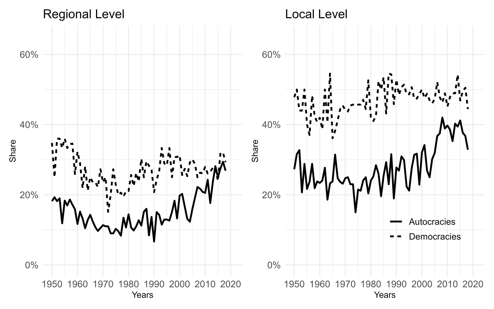
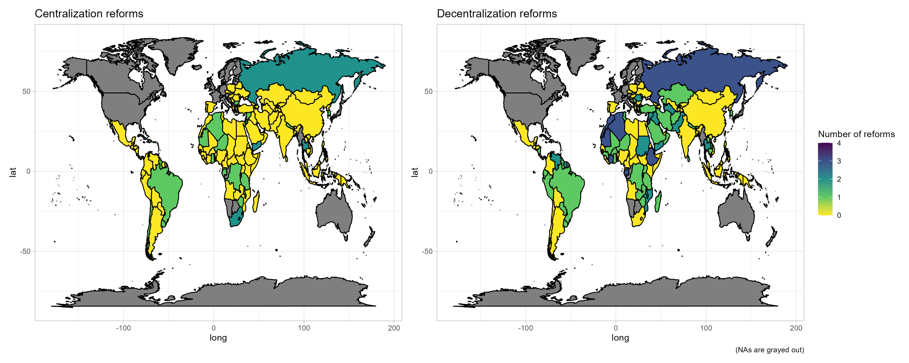
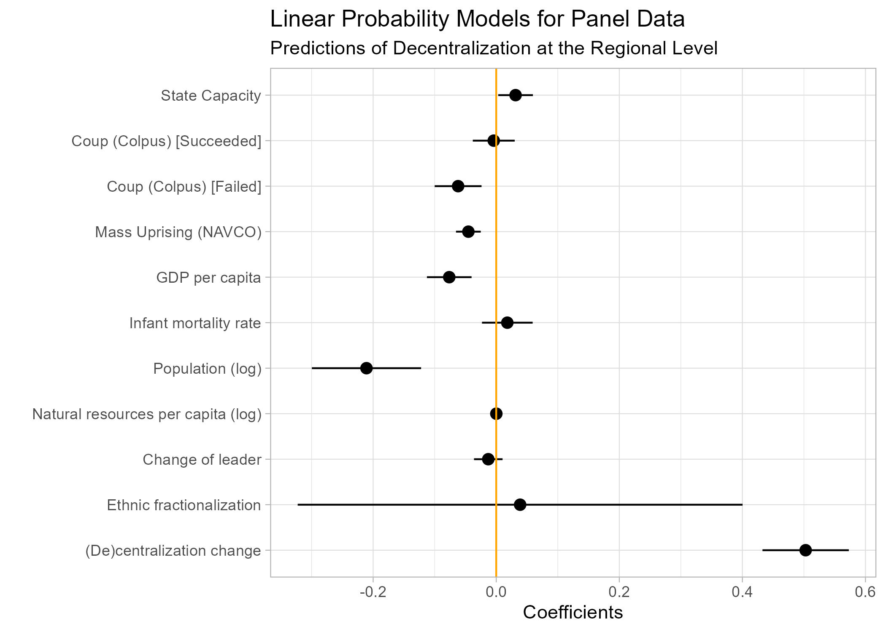
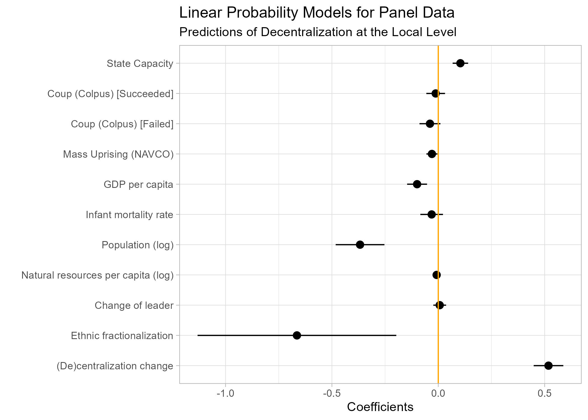

```{r setup, include=FALSE}
knitr::opts_chunk$set(echo = TRUE)
```

```{r packages, echo=TRUE, results='hide', message = FALSE, warning=FALSE}
pacman::p_load(
  htmltools,
  ggplot2,
  dplyr,
  readxl,
  plm,
  pglm,
  stargazer,
  hrbrthemes,
  htmlTable,
  writexl,
  maps,
  knitr,
  patchwork,
  modelsummary
)
```

## Shares of democratic and authoritarian countries with elected subnational governments  

There is an increasingly upward trend of autocracies with politically decentralized governance. Since the 1950s, while the share of democracies with elected subnational institutions has remained almost constant, there is a growing number of dictatorships adopting elections at both regional and local levels (see Fig. 1). This dynamic is not, however, specific to any particular region of the world (see Fig. 2).

```{r, echo=TRUE, results='hide', message = FALSE, warning=FALSE}
#### Figure 1 ####

vdem <- read_xlsx("vdem.xlsx") # uploading data for the first descriptive plot

## regional level 
reg <- vdem %>% 
  select(year, e_p_polity, country_name, v2elsrgel) %>% 
  filter(year >= "1950") %>% # filtering observations since 1975 
  filter(e_p_polity != c(-88, -77, -66)) %>% # excluding cases of foreign “interruption”, cases of “interregnum,” and cases of “transition”
  mutate(Regime = case_when(e_p_polity <= 5 ~ 'Autocracies', e_p_polity > 5 ~ 'Democracies')) %>% # creating a new variable for distinguishing between autocracies and democracies
  group_by(year, Regime) %>%  # grouping so that the unit of observation is regime-year rather than country-year
  mutate("share" = n_distinct(country_name[v2elsrgel == c("2","5")])/n_distinct(country_name)) %>% # calculation of the share of observations with a decentralized type of subnational government
  select(year, share, Regime, country_name) %>% 
  ggplot(aes(x=year, y = share, group = Regime))+ # plotting results
  geom_line(aes(y = share, linetype = Regime), lwd=1) +
    labs(title="Regional Level")+
    xlab("Years") +
    ylab("Share")+
  scale_y_continuous(limits = c(0, 0.65), labels = scales::percent)+ # adjustment of the scale limits
  scale_x_continuous(limits = c(1950, 2021), 
                     breaks = c(1950, 1960, 1970, 1980, 1990, 2000, 2010, 2020))+
  theme_minimal()+
  theme(title = element_text(size=12), # font settings
        axis.text=element_text(size=11),
        axis.title=element_text(size=10),
        legend.position = "none",
        text = element_text(size=13)
  )


## local level 
loc <- vdem %>% 
  select(year, e_p_polity, country_name, v2ellocelc) %>% 
  filter(year >= "1950") %>% 
  filter(e_p_polity != c(-88, -77, -66)) %>%
  mutate(Regime = case_when(e_p_polity <= 5 ~ 'Autocracies', e_p_polity > 5 ~ 'Democracies')) %>%
  group_by(year, Regime) %>%  
  mutate("share" = n_distinct(country_name[v2ellocelc == c("2","5")])/n_distinct(country_name)) %>%
  select(year, share, Regime, country_name) %>% 
  ggplot(aes(x=year, y = share, group = Regime))+
  geom_line(aes(y = share, linetype = Regime), lwd=1) +
    labs(title="Local Level")+
    xlab("Years") +
    ylab("Share")+
    scale_y_continuous(limits = c(0, 0.65), labels = scales::percent)+
  scale_x_continuous(limits = c(1950, 2021), 
                     breaks = c(1950, 1960, 1970, 1980, 1990, 2000, 2010, 2020))+
  theme_minimal()+
  theme(title = element_text(size=12),
        axis.text=element_text(size=11),
        axis.title=element_text(size=10),
        legend.position = c(0.7, 0.2),
        legend.title=element_blank(),
        text = element_text(size=13)
  )

combinedplot1 <- reg+loc # function from the 'patchwork' package

ggsave(plot = combinedplot1, 'fig1trends.jpeg', height = 5, width = 8, scale = 1, dpi = 600, units = "in")

```

### Figure 1  



## Variation in the number of cases of centralization at the regional and local levels: 1950 -- 2018 (131 countries)

```{r, echo=TRUE, results='hide', message = FALSE, warning=FALSE}
#### Figure 2 ####

table_maps <- read_xlsx("table_maps.xlsx") 

# creation of variables summarizing cases of centralization and decentralization reforms
table_maps$decentralization <- table_maps$reg_decent + table_maps$loc_decent  
table_maps$centralization <- table_maps$reg_cent + table_maps$loc_cent  

# uplpoading data for geographic coordinates
world_map <- map_data("world")

# merging original data and coordinates
map.world_joined <- left_join(world_map, table_maps, by = c('region' = 'country_name'))

map1 <- ggplot() +
  geom_polygon(data = map.world_joined, aes(x = long, y = lat, group = group, fill = decentralization), color = "black") +
  scale_fill_gradientn(
    colors = c("#fde725", "#5ec962", "#21918c", "#3b528b", "#440154"),
    values = scales::rescale(c(0, 1, 2, 3, 4)),
    limits = c(0, 4),
    guide = "colorbar",
    name = "Number of reforms"
  ) +
  ggtitle("Decentralization reforms")+
  labs(caption = "(NAs are grayed out)") +
  theme_light()

map2 <- ggplot() +
  geom_polygon(data = map.world_joined, aes(x = long, y = lat, group = group, fill = centralization), color = "black") +
  scale_fill_gradientn(
    colors = c("#fde725", "#5ec962", "#21918c"),
    values = scales::rescale(c(0, 1, 2)),
    limits = c(0, 2),
    name = "",
    breaks = c(0, 1, 2)
  ) +
  ggtitle("Centralization reforms")+
  #labs(caption = "NAs are grayed out") +
  theme_light() +
  theme(legend.position = "none")

combinedplot2 <- map2+map1

ggsave(plot = combinedplot2, 'maps.jpeg', height = 6, width = 15, units = "in")
```

### Figure 2  



## Preparing data for analysis  

```{r, echo=TRUE, results='hide', message = FALSE, warning=FALSE}
data <- read_xlsx("data_analysis.xlsx")

# re-coding dependent variables into binary indicators
data <- data %>% 
  mutate(
    v2elsrgel = ifelse(v2elsrgel %in% c(1, 2), 1, 0),
    v2ellocelc = ifelse(v2ellocelc %in% c(1, 2), 1, 0)
  )

# modification of some independent variables 

## fixing the problem of the '-inf' values of logarithm of 'e_total_fuel_income_pc', as well as creation of logged e_pop, peinfmor_log, and e_gdppc 
data <- data %>% 
  mutate(e_total_fuel_income_pc_log = log(e_total_fuel_income_pc + 0.001)) %>% 
  mutate(e_pop_log = log(e_pop)) %>% 
  mutate(e_peinfmor_log = log(e_peinfmor)) %>% 
  mutate(e_gdppc_log = log(e_gdppc))

# creating a t-1 variable 
data <- data %>%
  group_by(country_name) %>%
  mutate(
    v2elsrgel_change = ifelse(!is.na(v2elsrgel), as.numeric(v2elsrgel) - dplyr::lag(as.numeric(v2elsrgel)), NA),
    v2ellocelc_change = ifelse(!is.na(v2ellocelc), as.numeric(v2ellocelc) - dplyr::lag(as.numeric(v2ellocelc)), NA)
  )

# creating lag variables (lag in two years)
data <- data %>%
  group_by(country_name) %>%
  arrange(year) %>%
  mutate(
    lag_coup_2 = factor(lag(coup_colpus, n = 2, default = "0")),
    lag_campaign_2 = factor(lag(CAMPAIGN, n = 2, default = "0")),
    lag_leader_change_2 = factor(lag(leader_change, n = 2, default = "0")),
  ) %>%
  ungroup()


# sorting the data by country and year
data <- data %>% 
  arrange(country_name, year)

```

## What factors determine whether dictators choose to centralize or decentralize political power at the subnational level?  

**Hypothesis 1: Higher levels of state capacity in an authoritarian state are associated with a greater likelihood of adopting a politically decentralized system of subnational governance.**  

**Hypothesis 2: Increased erosion of regime legitimacy is linked to a higher probability of implementing a politically centralized system of subnational governance.**  

Equation: 

$Y_{it} = \beta_0 + \beta_1X_{it} + \beta_2Z_{it} + \gamma_i + \delta_t + \epsilon_{it}$  

*where i indices countries and t years. $Y_{it}$ represents the binary dependent variable for country i in year t. $X_{it}$ represents the independent variable(s) of interest for country i in year t. $Z_{it}$ represents additional controls for country i in year t. $\gamma_i$ and $\delta_t$ are the fixed effects for the individual country and time period, respectively. $\epsilon_{it}$ represents the error term.*

### Regional level

```{r, echo=TRUE, message = FALSE, warning=FALSE}
summary(mod1 <- plm(v2elsrgel ~  v2elsrgel_change + EFindex + lag_leader_change_2 + e_total_fuel_income_pc_log + e_pop_log + e_peinfmor_log + e_gdppc_log + lag_campaign_2 + lag_coup_2 + Capacity,
            data = data, effect = "twoways", model = "within", index = c("country_name", "year"), cluster = "country_name"))


covnames1 = c('v2elsrgel_change' = '(De)centralization change',
         'EFindex' = 'Ethnic fractionalization',
         'lag_leader_change_21' = 'Change of leader',
         'e_total_fuel_income_pc_log' = 'Natural resources per capita (log)',
         'e_pop_log' = 'Population (log)',
         'e_peinfmor_log' = 'Infant mortality rate',
         'e_gdppc_log' = 'GDP per capita',
         'lag_campaign_21' = 'Mass Uprising (NAVCO)',
         'lag_coup_21' = 'Coup (Colpus) [Failed]',
         'lag_coup_22' = 'Coup (Colpus) [Succeeded]',
         'Capacity' = 'State Capacity')

coefplot1 <- modelplot(mod1, coef_map = covnames1) +
  geom_vline(xintercept = 0, col = "orange") +
  labs(
    x = "Coefficients",
    title = "Linear Probability Models for Panel Data",
    subtitle = "Predictions of Decentralization at the Regional Level"
    ) +
  theme_light()

ggsave(plot = coefplot1, 'coefplot1.jpeg', height = 5, width = 7, units = "in")
```



### Local Level  

```{r, echo=TRUE, message = FALSE, warning=FALSE}
summary(mod2 <- plm(v2ellocelc ~  v2ellocelc_change + EFindex + lag_leader_change_2 + e_total_fuel_income_pc_log + e_pop_log + e_peinfmor_log + e_gdppc_log + lag_campaign_2 + lag_coup_2 + Capacity,
            data = data, effect = "twoways", model = "within", index = c("country_name", "year"), cluster = "country_name"))

covnames2 = c('v2ellocelc_change' = '(De)centralization change',
         'EFindex' = 'Ethnic fractionalization',
         'lag_leader_change_21' = 'Change of leader',
         'e_total_fuel_income_pc_log' = 'Natural resources per capita (log)',
         'e_pop_log' = 'Population (log)',
         'e_peinfmor_log' = 'Infant mortality rate',
         'e_gdppc_log' = 'GDP per capita',
         'lag_campaign_21' = 'Mass Uprising (NAVCO)',
         'lag_coup_21' = 'Coup (Colpus) [Failed]',
         'lag_coup_22' = 'Coup (Colpus) [Succeeded]',
         'Capacity' = 'State Capacity')

coefplot2 <- modelplot(mod2, coef_map = covnames2) +
  geom_vline(xintercept = 0, col = "orange") +
  labs(
    x = "Coefficients",
    title = "Linear Probability Models for Panel Data",
    subtitle = "Predictions of Decentralization at the Local Level"
    ) +
  theme_light()

ggsave(plot = coefplot2, 'coefplot2.jpeg', height = 5, width = 7, units = "in")
```


